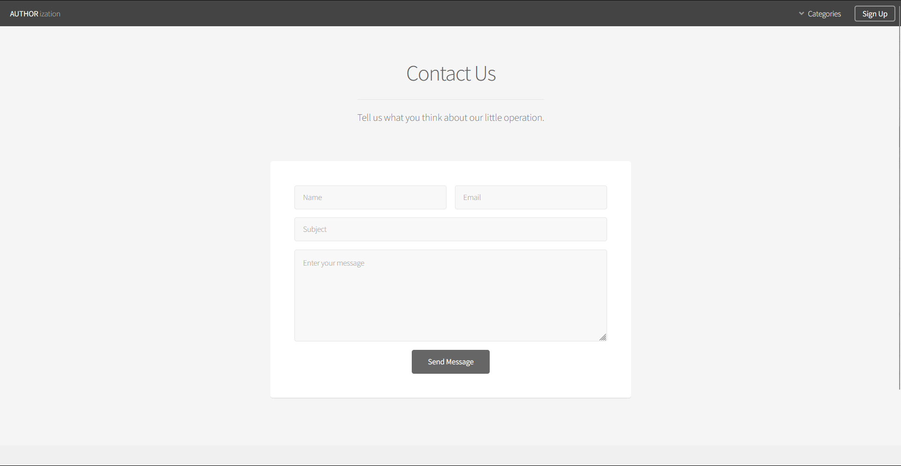
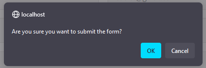
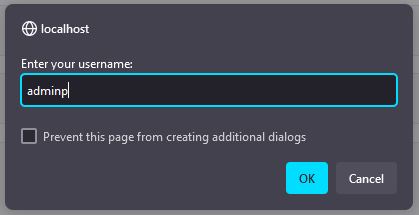
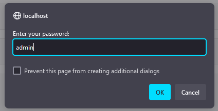

<!-- PROJECT LOGO -->

<h3 align="center">AUTHORization</h3>

  

    This repository contains the source code for an authorization website, demonstrating the importance and functionality of authorization in web applications.
     
     
    <a href="https://github.com/github_username/repo_name">View Demo</a>
  

<!-- ABOUT THE PROJECT -->
## About The Project

<table>
    <tr>
        <td>
            
             
            
UI
</td>   
    </tr>

</table>

<table>
    <tr>
        <td>
            
                 
                
Submission Alert
</td>
        <td>
            
             
            
Username Alert
</td>   
        <td>
            
                 
                
Confirmation Alert
</td>
    </tr>

</table>

Here's a blank template to get started: To avoid retyping too much info. Do a search and replace with your text editor for the following: `github_username`, `repo_name`, `twitter_handle`, `linkedin_username`, `email_client`, `email`, `project_title`, `project_description`

(<a href="#readme-top">back to top</a>)

<!-- GETTING STARTED -->
## Getting Started

This is an example of how you may give instructions on setting up your project locally.
To get a local copy up and running follow these simple example steps.

### Usage

1. Clone this repository to your local machine.
2. Install any necessary dependencies.
3. Configure the application settings, including database connection details.
4. Run the application locally or deploy it to a server.
5. Access the website through a web browser.

(<a href="#readme-top">back to top</a>)

<!-- CONTRIBUTING -->
## Contributing

Contributions are what make the open source community such an amazing place to learn, inspire, and create. Any contributions you make are **greatly appreciated**.

If you have a suggestion that would make this better, please fork the repo and create a pull request. You can also simply open an issue with the tag "enhancement".
Don't forget to give the project a star! Thanks again!

1. Fork the Project
2. Create your Feature Branch (`git checkout -b feature/AmazingFeature`)
3. Commit your Changes (`git commit -m 'Add some AmazingFeature'`)
4. Push to the Branch (`git push origin feature/AmazingFeature`)
5. Open a Pull Request

(<a href="#readme-top">back to top</a>)

<!-- LICENSE -->
## License

Distributed under the MIT License. See `LICENSE.txt` for more information.

(<a href="#readme-top">back to top</a>)

<!-- CONTACT -->
## Contact

Your Name - [@twitter_handle](https://twitter.com/twitter_handle) - email@email_client.com

Project Link: [https://github.com/github_username/repo_name](https://github.com/github_username/repo_name)

(<a href="#readme-top">back to top</a>)

